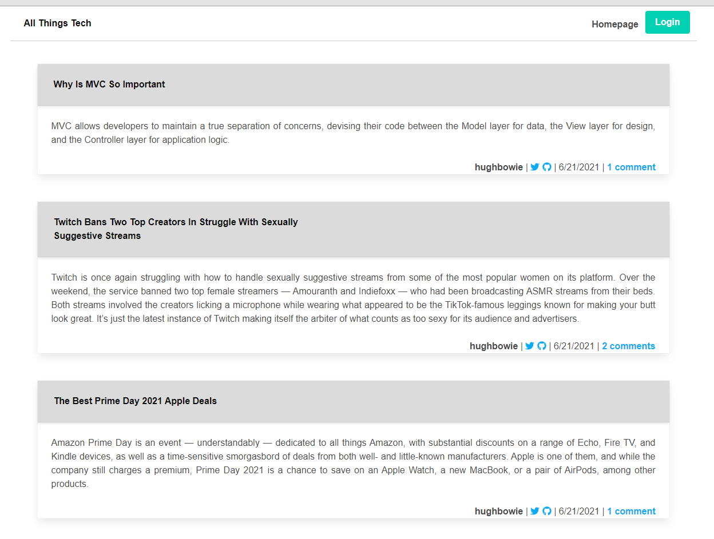

<h1 align="center">Tech Blog Model-View-Controller (MVC)</h1>
  

    
    
    
    
    </a>

  

    
    
    
    
    
    

   
## Description

A CMS-style Blog built using Model View Controller (MVC) paradigm. Built using MySQL2, Express, Sequelize, Bulma, Handlebars and dotenv.
  
## Below is a screenshot of the application:
  

   
## Table of Contents
- [Description](#description)
- [Table of Contents](#table-of-contents)
- [Installation](#installation)
- [Usage](#usage)
- [Questions](#questions)

## Installation

`npm init`

`npm install bcrypt bulma connect-session-sequelize dotenv express express-handlebars express-session mysql2 sequelize`
  
## Usage

`mysql -u root -p`

Enter PW 

`source db/schema.sql`

`quit`

`npm run seed`
  
`npm start`

## Questions
Contact me with any questions: [email](mailto:hughbowie@me.com) , [GitHub](https://github.com/hugh-bowie) 
